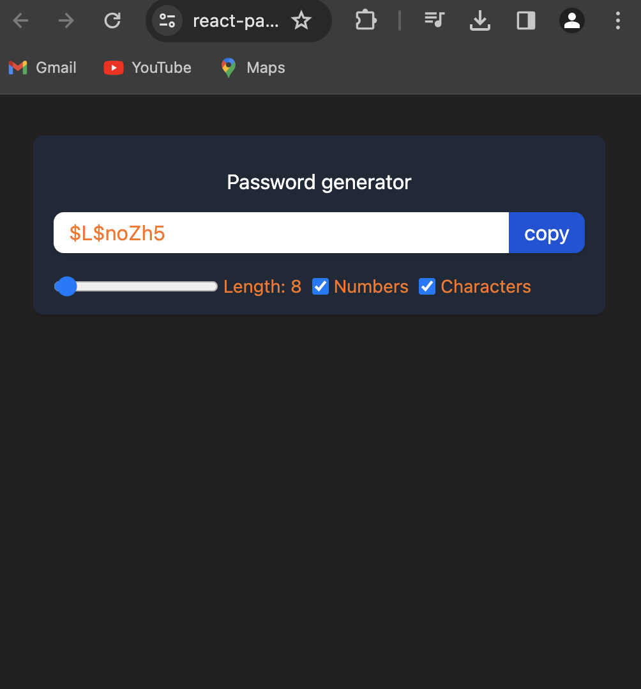

### React Password Generator Documentation

### Overview

The React Password Generator is a web application built with React, Vite for efficient development, Tailwind CSS for styling, and is deployed on Vercel. This project showcases the use of React hooks (useState, useEffect, useCallback, and useRef) to create a password generator with options to customize password length, include uppercase letters, numbers, and symbols. Additionally, it allows users to copy the generated password to the clipboard.


### Demo :



### You can Check it Live on Below Link :

[Live Link !](https://react-passwordgenerator.vercel.app/)


### Features
- Password Generation: Dynamically generates passwords based on user-defined options.
- Customization Options: Allows users to customize password length and include uppercase letters, numbers, and symbols.
- Clipboard Copy: Provides a convenient button to copy the generated password to the clipboard.
- Responsive Design: Utilizes Tailwind CSS for a responsive and visually appealing design.
- Efficient Development: Developed with Vite for a fast and efficient development experience.


### Technologies Used
1. React: A JavaScript library for building user interfaces.
2. Vite: A build tool that provides a faster and more efficient development experience for React applications.
3. Tailwind CSS: A utility-first CSS framework for building modern designs.
4. Vercel: A cloud platform for static sites and serverless functions, facilitating seamless deployment.

### Installation

To run the project locally, follow these steps:

1. Clone the repository:
```
git clone [repository-url]
cd react-passwordgenerator


```

2. Install dependencies:

```
npm install


```

3. Run the development server:

```
npm run dev


```

The project will be accessible at http://localhost:3000.


### Usage
1. Open the project in a web browser.
2. Adjust the password length and checkbox options for uppercase letters, numbers, and symbols.
3. Observe the dynamically generated password.
4. Click the "Copy to Clipboard" button to copy the generated password.


### React Hooks Used
- useState: Manages the state of password, password length, and customization options.
- useEffect: Generates a new password whenever relevant options change.
- useCallback: Prevents unnecessary re-renders when generating passwords.
- useRef: References the generated password input for copying to the clipboard.


### Deployment
The React Password Generator project is deployed using Vercel. Any changes pushed to the main branch are automatically deployed.

[Live Demo](https://react-passwordgenerator.vercel.app/)

### Contributing
If you'd like to contribute to the project, please follow these steps:

1. Fork the repository.
2. Create a new branch for your feature or bug fix.
3. Make your changes and submit a pull request.